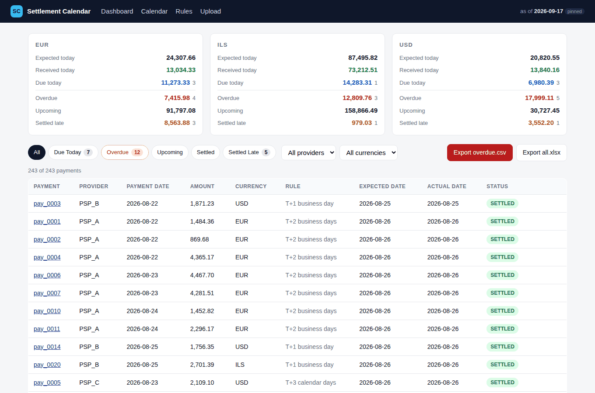
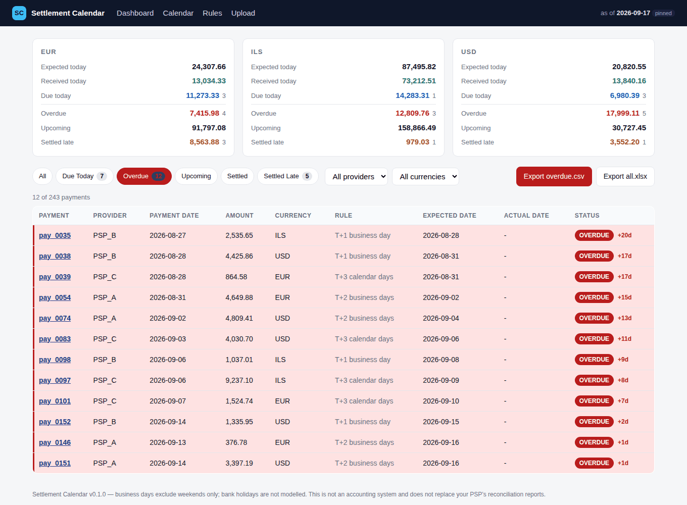
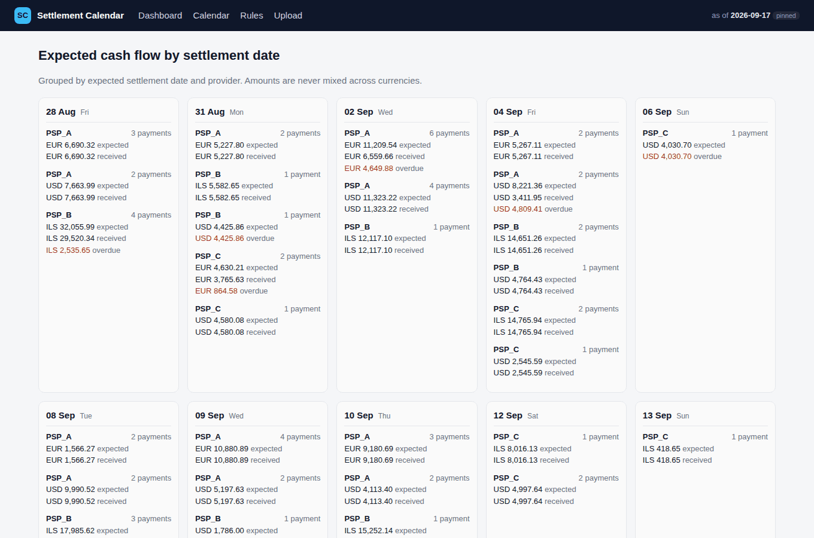
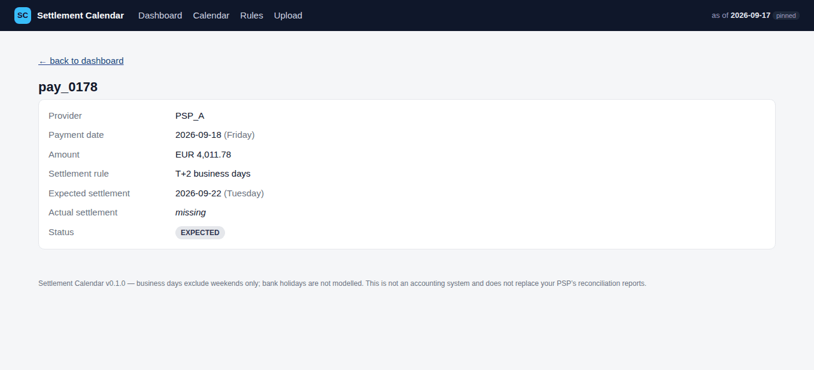
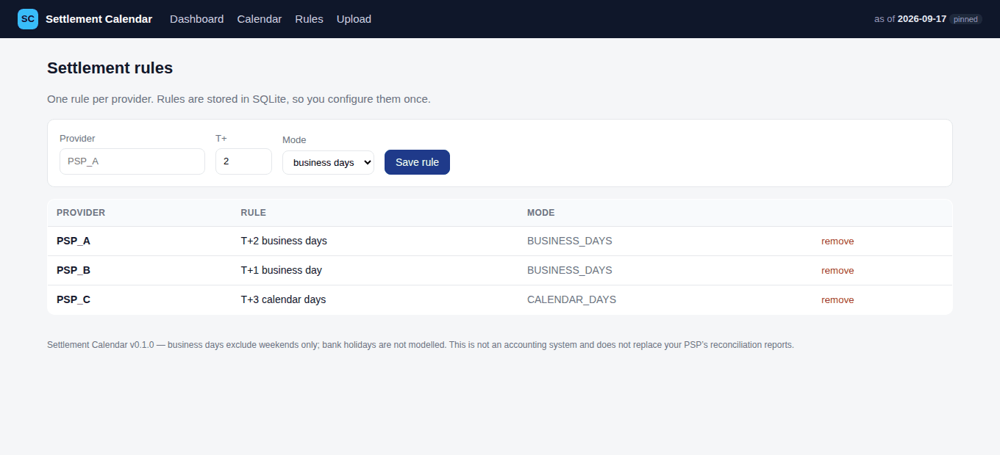

# Settlement Calendar

**Know when your PSP should pay you — and spot overdue settlements before they disappear into spreadsheets.**



## The problem

A payment succeeding is not the same as money arriving. Your PSP or acquirer pays out on a
delay — T+1, T+2, T+3 — and every provider uses a different rule. So the money for Monday's
sales lands on Wednesday, Friday's sales land on Tuesday, and a payout that silently never
arrives looks exactly like a payout that simply has not arrived *yet*.

Most small merchants track this in a spreadsheet, counting business days by hand:

```text
Payment successful:   14 Sep
PSP settlement rule:  T+2 business days
Expected settlement:  16 Sep
Actual settlement:    missing
Status:               OVERDUE
```

Settlement Calendar answers one question, and answers it well:

> **What money should have arrived, when should it have arrived, and what is overdue?**

## Use case

You run a shop, a SaaS, or a small marketplace with two or three payment providers. Every
month you export payments from your PSP dashboard and payouts from your bank or PSP
settlement report. You want to know, in under a minute:

* how much is supposed to land today, and how much of it actually landed;
* which payouts are late and by how many days;
* what next week's incoming cash flow looks like;
* a CSV of the overdue items you can send to your provider's support.

It is deliberately **not** a reconciliation platform. There is no fee matching, no
multi-leg payout splitting, no ledger. It is the missing calendar in front of your PSP.

## Main flow

```text
upload payments.csv
→ configure settlement rules
→ calculate expected settlement dates
→ optionally upload settlements.csv
→ match actual settlements by payment_id
→ show calendar / statuses
→ export overdue report
```

## Quick start

### Docker (recommended)

```bash
git clone https://github.com/VsevaTech/settlement-calendar.git
cd settlement-calendar
docker compose up --build
```

Open <http://localhost:8000>.

### Local Python

```bash
python3.12 -m venv .venv
source .venv/bin/activate
pip install -e ".[dev]"
export SC_AS_OF_DATE=2026-09-17    # pins "today" so the demo numbers match
uvicorn app.main:app --reload
```

Then walk the [live demo](#live-demo) below.

## Input formats

Both CSV and XLSX are supported. Column names are detected automatically; if detection
fails you get a column-mapping screen instead of an error.

### Payments (required)

| field | example | notes |
|---|---|---|
| `payment_id` | `pay_001` | unique; also the matching key |
| `provider` | `PSP_A` | must have a settlement rule |
| `payment_date` | `2026-09-14` | the date the payment succeeded |
| `amount` | `100.00` | parsed as `Decimal`, never float |
| `currency` | `EUR` | currencies are never summed together |

```csv
payment_id,provider,payment_date,amount,currency
pay_001,PSP_A,2026-09-14,100.00,EUR
pay_002,PSP_A,2026-09-15,75.50,EUR
pay_003,PSP_B,2026-09-15,320.00,ILS
```

### Settlements (optional)

```csv
settlement_id,payment_id,settlement_date,amount,currency
stl_001,pay_001,2026-09-16,100.00,EUR
```

Matching is done on `payment_id` only. If a payment is paid out more than once, the
earliest payout wins. Settlements referencing an unknown `payment_id` are stored but do not
create phantom rows.

### Automatic column detection

Headers such as `Txn ID`, `PSP`, `Transaction Date`, `Gross Amount`, `CCY` are recognised
without configuration. Dates are parsed from an explicit list of formats
(`2026-09-14`, `14.09.2026`, `14/09/2026`, ISO timestamps) — there is no fuzzy guessing,
because guessing wrong on a settlement date is worse than asking. Amounts accept
`1 234,56`, `1,234.56`, `1.234,56` and currency symbols.

Re-importing the same file updates the existing rows instead of duplicating them.

## Settlement rules

One rule per provider, stored in SQLite so you configure them once:

```text
PSP_A → T+2 business days
PSP_B → T+1 business day
PSP_C → T+3 calendar days
```

Two modes are supported:

* `BUSINESS_DAYS` — weekends are skipped when counting the offset.
* `CALENDAR_DAYS` — every day counts, weekends included.

Weekend days are configurable via `SC_WEEKEND_DAYS` (ISO weekday numbers, `6,7` by
default), so a Friday/Saturday weekend is a one-line change: `SC_WEEKEND_DAYS=5,6`.

## Status definitions

| status | meaning |
|---|---|
| `EXPECTED` | the expected settlement date has not arrived yet |
| `DUE_TODAY` | the money is due today and has not been received yet |
| `OVERDUE` | the expected date has passed and no settlement was found |
| `SETTLED` | the settlement arrived on or before the expected date |
| `SETTLED_LATE` | the settlement arrived after the expected date |

Status is always computed against an explicit `as_of_date`. The web app takes it from
`SC_AS_OF_DATE` when set, otherwise from the real current date; the core functions always
require it, which is what keeps the test suite deterministic.

## Calculation examples

```text
Payment:   Monday 14 Sep      Rule: T+2 business days   Expected: Wednesday 16 Sep
Payment:   Friday 18 Sep      Rule: T+1 business day    Expected: Monday 21 Sep
Payment:   Friday 18 Sep      Rule: T+2 business days   Expected: Tuesday 22 Sep
Payment:   Friday 18 Sep      Rule: T+3 calendar days   Expected: Monday 21 Sep
Payment:   Saturday 19 Sep    Rule: T+1 business day    Expected: Tuesday 22 Sep
```

The Friday + T+2 business days → Tuesday case is covered by a dedicated test, because it is
the rule everyone gets wrong by hand.

Money is parsed and stored as `decimal.Decimal` from end to end. `parse_money` raises on a
`float` input rather than silently accepting it, and SQLite stores amounts as exact text.

## Dashboard

The dashboard leads with the business answer, split per currency — amounts in different
currencies are never added together:

```text
                 EUR          ILS          USD
Expected today   24,307.66    87,495.82    20,820.55
Received today   13,034.33    73,212.51    13,840.16
Due today        11,273.33    14,283.31     6,980.39
Overdue           7,415.98    12,809.76    17,999.11
Upcoming         91,797.08   158,866.49    30,727.45
Settled late      8,563.88       979.03     3,552.20
```

*Expected today* is everything whose expected settlement date is today; *Received today* is
the part of it that actually arrived; *Due today* is the rest. *Overdue* covers every past
date, not just today.

Filters: `All`, `Due Today`, `Overdue`, `Upcoming`, `Settled`, `Settled Late`, plus provider
and currency. Overdue rows are marked in red with a left bar and a `+Nd` lateness badge.



### Calendar view

Expected settlements grouped by date and provider, so you can see incoming cash flow day by
day. Past days are only kept when they still carry outstanding money.



### Payment detail

Every row links to a detail page that shows the rule that was applied and the weekday
arithmetic behind the expected date — useful when a provider disputes a date.



## Export

`Export overdue.csv` produces the report you can actually send to your provider:

```csv
payment_id,provider,payment_date,amount,currency,expected_settlement_date,days_overdue,status
pay_0035,PSP_B,2026-08-27,2535.65,ILS,2026-08-28,20,OVERDUE
pay_0039,PSP_C,2026-08-28,864.58,EUR,2026-08-31,17,OVERDUE
```

`Export all.xlsx` exports every reconciled row with overdue and late rows highlighted.

## Live demo

The repository ships with a synthetic dataset whose numbers are fixed, so the demo always
shows the same result.

**Step 1 — start the app**

```bash
docker compose up --build
```

**Step 2 — upload `demo-data/payments.csv`** on the Upload page (243 payments).

**Step 3 — configure the rules** on the Rules page:

```text
PSP_A → T+2 business days
PSP_B → T+1 business day
PSP_C → T+3 calendar days
```



**Step 4 — upload `demo-data/settlements.csv`** (159 settlements).

**Step 5 — the dashboard shows**, with `SC_AS_OF_DATE=2026-09-17`:

```text
EUR   expected today 24,307.66   received 13,034.33   overdue  7,415.98
ILS   expected today 87,495.82   received 73,212.51   overdue 12,809.76
USD   expected today 20,820.55   received 13,840.16   overdue 17,999.11
```

**Step 6 — click `Overdue`.** Twelve specific payments are missing, worst first —
`pay_0035` is 20 days late.

**Step 7 — open a Friday payment**, for example `pay_0178`:

```text
Payment date:     2026-09-18 (Friday)
Settlement rule:  T+2 business days
Expected:         2026-09-22 (Tuesday)
```

**Step 8 — download `overdue.csv`** from the dashboard.

## Demo dataset

`demo-data/` is fully synthetic — no real payment data is involved at any point. It is
produced by a seeded generator and the counts are deterministic:

```text
243 payments, 159 settlements, 2026-08-22 … 2026-09-24
12  OVERDUE
 7  DUE_TODAY
 5  SETTLED_LATE
154 SETTLED
65  EXPECTED
```

It deliberately contains normal settlements, upcoming settlements, payments due today,
missing settlements, late settlements, Friday and weekend payment dates, and three
currencies (EUR, USD, ILS). The committed CSVs are produced by that generator - regenerate
them at any time with:

```bash
python -m app.demo.generate --as-of 2026-09-17 --out demo-data
```

The `assets` workflow re-runs the generator on every push and commits the result if it ever
differs, and CI diffs it as well, so the demo cannot drift away from the documented numbers.

## Tests

```bash
pip install -e ".[dev]"
pytest
ruff check .
```

69 tests cover business-day and calendar-day arithmetic (including Friday + T+1/T+2,
Saturday and Sunday handling, and custom weekends), all five statuses, matching by
`payment_id`, missing settlements, `Decimal` parsing, multiple currencies, CSV and XLSX
import, invalid input, the column-mapping flow, the exports, and the demo dataset counts.

No test depends on the real current date: every calculation takes an explicit `as_of_date`.

## Architecture

```text
app/
  main.py                        FastAPI routes only - no business logic
  config.py                      settings (SC_* environment variables)
  db.py                          engine, session, schema bootstrap
  models/
    db_models.py                 SQLAlchemy 2 models (money stored as exact text)
    schemas.py                   Pydantic models for the view layer
  services/
    settlement_calendar.py       pure date/status/Decimal logic - no framework imports
    reconciliation.py            payments + rules + settlements -> rows, totals, calendar
    import_service.py            CSV/XLSX reading, column detection, mapping
    export_service.py            overdue.csv and all.xlsx
  demo/generate.py               synthetic dataset generator
  templates/                     Jinja2 (HTMX swaps the dashboard filter panel)
  static/                        stylesheet
tests/                           pytest
scripts/capture_screenshots.py   seeds a running instance and screenshots it
demo-data/                       synthetic payments.csv / settlements.csv
```

`app/services/settlement_calendar.py` imports nothing from FastAPI, SQLAlchemy or pandas,
so all of the calendar logic is unit-testable without starting the web application.

HTMX is loaded from a CDN with an integrity hash and only swaps the dashboard filter panel;
every page is a plain server-rendered form or link and works with JavaScript disabled.

Stack: Python 3.12, FastAPI, Pydantic v2, SQLAlchemy 2, SQLite, pandas, Jinja2 + HTMX,
openpyxl, pytest, ruff, Docker. No AI is involved in any calculation — the settlement dates
are plain deterministic Python.

## Configuration

| variable | default | meaning |
|---|---|---|
| `SC_DATABASE_URL` | `sqlite:///./data/settlement_calendar.db` | SQLAlchemy URL |
| `SC_AS_OF_DATE` | *(empty → real today)* | pins "today" for status calculation |
| `SC_WEEKEND_DAYS` | `6,7` | non-business days, ISO weekday numbers |

See `.env.example`. No credentials or external services are required, ever.

## Docker

```bash
docker compose up --build       # http://localhost:8000
docker compose down             # keeps the SQLite volume
docker compose down -v          # drops it and starts clean next time
```

The image runs `uvicorn` on port 8000, stores SQLite in the `settlement-data` volume and
ships a `/health` endpoint used by the container healthcheck and by CI.

## Limitations

* **Business-day calculations currently exclude weekends only. Public and bank holidays are
  not included in the MVP.** A payout expected on 1 January will be reported as due that
  day.
* Matching is done on `payment_id` only. Aggregated payouts (one bank credit covering many
  payments), fees, refunds, chargebacks and FX conversion are out of scope.
* Amount differences between a payment and its settlement are shown on the detail page but
  do not change the status — status is about *timing*, not *amount*.
* One rule per provider. Rules are not versioned, so changing a rule re-dates historical
  payments too.
* Single user, no authentication. Run it locally or behind your own access control.
* This is not an accounting system and does not replace your PSP's or acquirer's
  reconciliation reports. Treat its output as an early-warning signal, not as a book of
  record.

## License

MIT — see [LICENSE](LICENSE).
